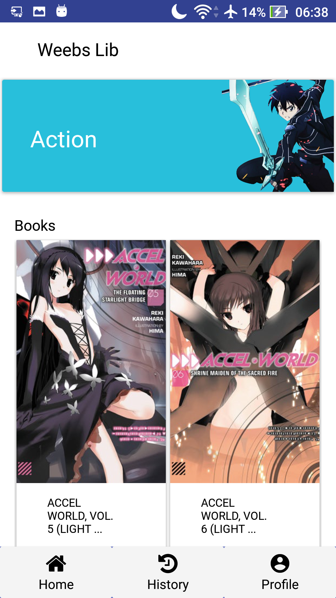
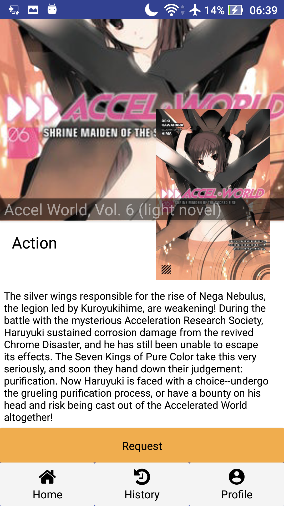
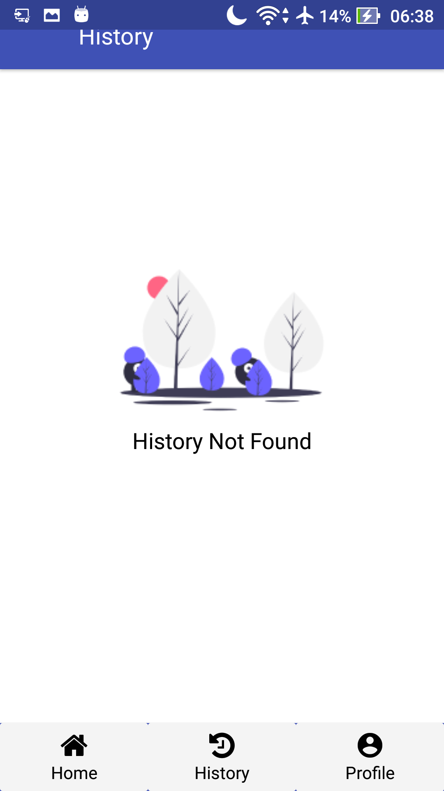

# WeebsLib
## Description
  React Native App based on weebs-lib web app. users can explore, search and request to borrow book with ease. User can also see their own borrowing history. 
  
## Build With 
  - [Node JS](https://nodejs.org/en/)
  - [React Native](https://facebook.github.io/react-native/)
  - [Redux](https://redux.js.org/)

## Screenhots
| Home          | Book Detail  | History      |
|---------------|--------------|--------------|
|  |  | |
